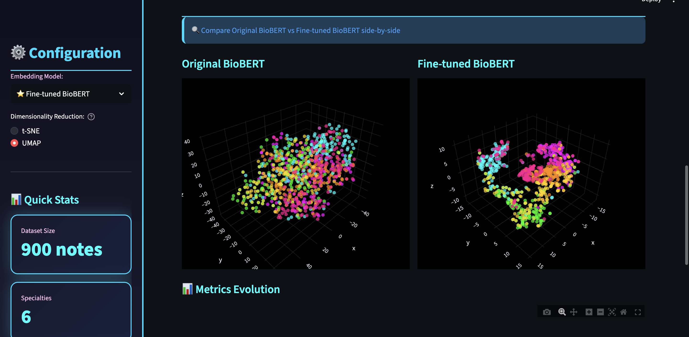

# Medical Embedding Visualization

## What This Project Is About

I wanted to understand what really happens behind the scenes in AI models - specifically, how data looks in high-dimensional space. Because at the end of the day, regardless of how big or fancy a model is, it all comes down to embeddings. That moment where the data transforms from something we understand (text) into something the computer works with (vectors) - that's what fascinated me.

I chose medical data specifically because it's *nuanced*. A radiology note about an MRI could be related to both neurology and cardiology depending on what they're scanning. These subtle, overlapping boundaries between specialties - that's where things get interesting. How does a model learn to separate them? Where do the boundaries form in embedding space?

So I built this to:
- Visualize what 900 medical notes look like in embedding space
- See if fine-tuning could actually untangle these subtle boundaries
- Watch how triplet loss reshapes the space to separate overlapping specialties

**The result?** Fine-tuning with triplet loss improved specialty clustering by 58.7%. But more importantly, I got to *see* how the model learned to handle those tricky overlapping cases - radiology notes that could go either way, cardiovascular notes that touch pulmonary territory. The boundaries became clearer, but they're still beautifully complex.

---

## What I Was Exploring

The main question I had: **which metrics actually matter, and what do they tell us about what the model "understands"?**

I used three different metrics:
- **Silhouette Score** - measures how tight clusters are vs how separated they are from each other
- **Davies-Bouldin Index** - looks at cluster overlap
- **Precision@5** - practical test: when you search for similar notes, how many in the top 5 actually match?

I wanted to see if improving these numbers meant the model was actually getting better at understanding those subtle boundaries between specialties, or if it was just... moving numbers around.

---

## What It Looks Like

### The Results

The metrics tell the story - triplet loss made the model *understand* the boundaries:


*Clear improvement across all three metrics: better clustering, better separation, better retrieval*

### Before vs After

Here's what happened in embedding space:


*Left: Original BioBERT (random cloud). Right: Fine-tuned (clear clusters). Same data, completely different structure.*

### Interactive Exploration

You can rotate, zoom, and click on any point to see the actual medical note:


*Each color is a different specialty. Notice how they cluster in distinct regions - radiology (yellow) has its own space, surgery (pink) groups together.*

### The Technical Bits


*Training configuration and how this applies to robotics problems*

---

## How I Built This

### The Training Approach

I used **triplet margin loss** for fine-tuning. I'd read about it and thought it fit the problem perfectly - instead of just classifying specialties, it teaches the model to understand *relationships*: "pull similar things closer, push different things apart."

The way it works:
- Take three notes at a time: an anchor, a positive (same specialty), and a negative (different specialty)
- The model learns to place the anchor closer to the positive than to the negative
- Do this 2000 times with different combinations

### The Setup

**Base Model:** BioBERT (biomedical pre-trained BERT)
- 768-dimensional embeddings
- Added a projection head on top

**Training:**
- 2000 training triplets, 400 validation triplets
- Batch size: 8
- 5 epochs
- AdamW optimizer with cosine annealing

**What Made It Work:**
The triplet loss forced the model to learn the subtle boundaries. It couldn't just memorize categories - it had to understand which features make a cardiology note similar to another cardiology note, even when they're talking about different procedures.

### The Metrics I Tracked

I used three metrics to see if it was actually working:
- **Silhouette Score:** Went from -0.0006 to 0.2807 (random → structured)
- **Davies-Bouldin Index:** Dropped from 6.49 to 1.38 (less overlap)
- **Precision@5:** Improved from 43.7% to 69.4% (better retrieval)

These weren't just numbers moving - they represented the model actually learning those nuanced boundaries I was curious about.

---

## How to Run This

### Quick Start
```bash
# Clone the repo
git clone https://github.com/AmulyaP07-15/medical-embedding-visualization.git
cd medical-embedding-visualization

# Set up virtual environment
python -m venv venv
source venv/bin/activate  # On Windows: venv\Scripts\activate

# Install dependencies
pip install -r requirements.txt

# Generate sample data for the demo
python create_sample_data.py

# Run the app
python -m streamlit run streamlit_app.py
```

The app will open at `http://localhost:8501`

### What You'll See

The Streamlit app has four main sections:
- **Performance Metrics** - The improvement numbers and comparison charts
- **3D Visualization** - Interactive embedding space (rotate, zoom, explore)
- **Comparison Analysis** - Side-by-side before/after
- **Technical Details** - Training configuration and methodology

### Note on Data

The sample data generator creates synthetic embeddings for demonstration. It's perfect for exploring the UI and understanding the approach, but the metrics shown are from training on real medical transcription data.

---

## Technologies Used

- **PyTorch** - Deep learning framework
- **Transformers** - Pre-trained language models (BioBERT)
- **Streamlit** - Interactive web application
- **Plotly** - 3D visualizations
- **scikit-learn** - Metrics and evaluation
- **FastAPI** - Alternative backend (optional)

---

## Project Structure
```
medical-embedding-visualization/
├── backend/
│   ├── train_triplet.py           # Training script
│   ├── triplet_dataset.py         # Dataset generator
│   ├── evaluate_improvement.py    # Metrics evaluation
│   ├── embedding_models.py        # Model definitions
│   └── app.py                     # FastAPI server
├── frontend/
│   ├── index.html                 # Three.js visualization
│   └── js/                        # JavaScript modules
├── streamlit_app.py               # Main Streamlit app
├── create_sample_data.py          # Sample data generator
└── requirements.txt               # Dependencies
```

---

## Author

**Amulya Penikialapati**

- M.S. Artificial Intelligence @ Northeastern University
- Software Engineer @ Capgemini

Feel free to reach out if you have questions about the implementation or want to discuss metric learning and embeddings!

---

## License

MIT License - feel free to use this code for your own projects.
